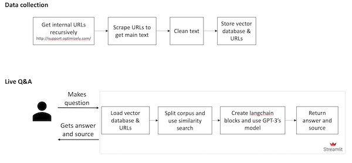
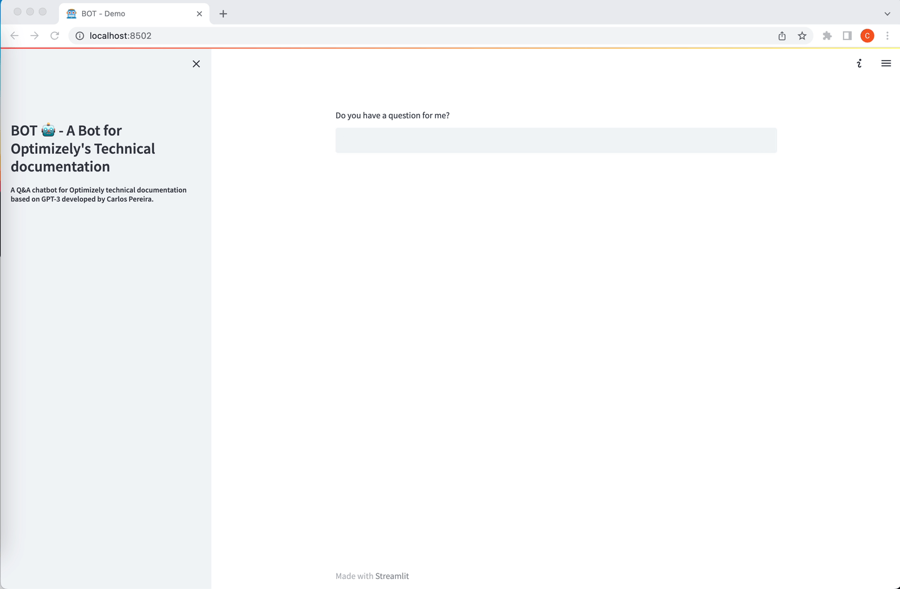

# BOT - A Bot for Technical documentation

## Description

Some months ago, as a proof of concept and weekend project, I created a Q&A chatbot based on GPT-3.5 for Optimizely's support documentation.

I am sharing here now that hacky code because, with some tweaks, I think you can use this as base for other scenarios.

## Architecture

The data collection is arguably the most difficult step. Here, it is done automatically, and recursively by getting all internal links of http://support.optimizely.com/ using [linkchecker](https://pypi.org/project/LinkChecker/).

Then, for each URL found, the content of interest (i.e., an HTML class, assuming that is always the same) is scraped using Selenium and Beautiful Soup, cleaned, and stored as a local [FAISS vector database](https://python.langchain.com/docs/modules/data_connection/vectorstores/integrations/faiss). 

All pairs (cleaned text and URL) are then used together with GPT-3.5’s [text-davinci-003](https://platform.openai.com/docs/models/gpt-3-5) model for answering questions with sources using [LangChain](https://python.langchain.com/).

The architecture:

## Setup

This project has as main pre-requisites (detailed in Pipfile):
- Python 3.10
- LangChain 0.0.55

How to run:
1. Clone this repo
2. Open a terminal within that folder
3. Run `pip install pipenv`
4. Run `pipenv install` to install the dependencies from Pipfile 
5. Run `pipenv shell`
6. Run `python build_db.py` 
10. Finally, run `streamlit run bot.py` to interact with the bot

You need to customize `build_db.py`:
- add your OpenAI's key
- define your starting URLs
- define any additional URLs filtering rule
- define your class html where the text is in the URLs

You need to customize `bot.py`:
- add your OpenAI's key

## Demo

## WARNING:
As web scraping is done for the data collection, please use this carefully and according to the legal regulations.
